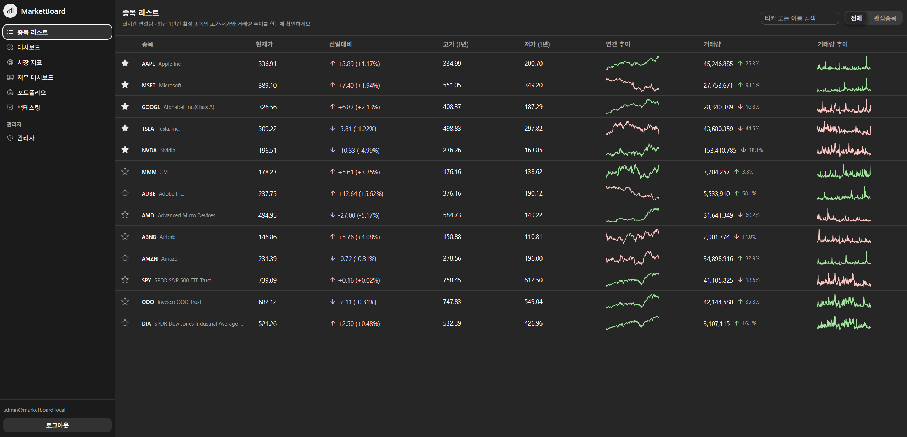
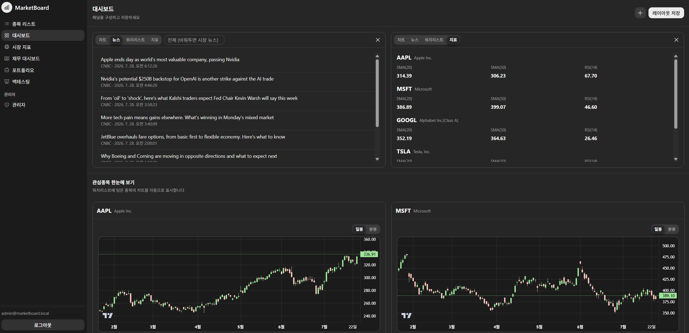
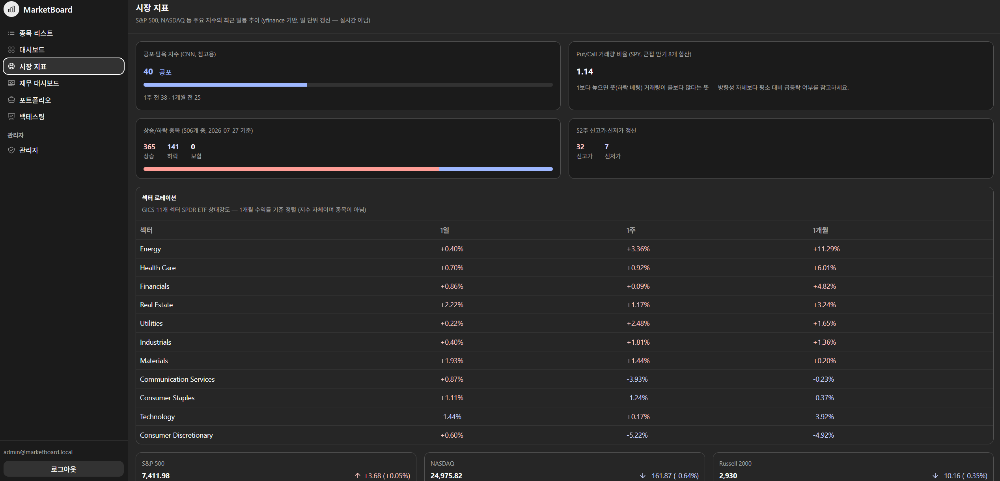

# MarketBoard

실시간 주식 시세·시장 지표·포트폴리오 관리 웹 서비스. Spring Boot(Java) + Python(FastAPI) + Next.js(React) 3-tier 구조로 기획부터 개발·배포·운영까지 개인이 전담한 프로젝트입니다.

🔗 **Live**: https://marketboard.duckdns.org





## 주요 기능

- **실시간 시세** — Finnhub WebSocket으로 수신한 틱을 Redis Pub/Sub → Spring STOMP 경로로 브라우저까지 전달. 종목 리스트/대시보드에서 가격 변동을 실시간으로 반영
- **종목 상세** — 캔들 차트(기간/분봉·일봉 선택, SMA 오버레이 유저별 커스터마이즈), 기업 개요, 뉴스, 개별 종목 Put/Call 비율, 옵션 지지/저항(맥스페인)
- **시장 지표 대시보드** — 주요 지수, 시장 폭(등락/신고가·신저가), CNN 공포탐욕지수, SPY Put/Call 비율, 섹터 로테이션(SPDR 11개 섹터 ETF 상대강도) — 로그인 없이 볼 수 있는 공개 페이지(`/overview`)도 제공
- **재무 비교** — 여러 종목의 재무제표/밸류에이션 지표를 나란히 비교
- **포트폴리오 관리** — 보유 종목/매매 기록 기반 손익 관리
- **백테스팅** — 여러 종목 동일비중 매수후보유 전략을 SPY 벤치마크와 비교(총수익률/CAGR/MDD/변동성/샤프비율, 자산가치 곡선)
- **관심종목(Watchlist), 커스텀 대시보드, 관리자 페이지**(종목/유저 관리, S&P500 유니버스 배치, 딥백필 트리거)
- **인증** — JWT 기반 회원가입/로그인/리프레시/로그아웃, Bucket4j 레이트리밋으로 브루트포스 방어

## 아키텍처

```
Finnhub WS ──▶ collector (FastAPI) ──▶ Redis (Pub/Sub, 캐시) ──▶ marketboardBackend (Spring Boot) ──▶ frontend (Next.js)
                     │                                                 │
                     └────────────────────▶ MySQL ◀───────────────────┘
```

- **frontend** (`frontend/`) — Next.js 16 / React 19, Astryx 디자인 시스템, STOMP over SockJS로 실시간 시세 구독, `lightweight-charts`로 캔들/지표 차트
- **marketboardBackend** (`marketboardBackend/`) — Spring Boot 4 / Java 17, JWT 인증, JPA + MySQL, Redis 캐싱, STOMP WebSocket, Flyway 마이그레이션, Prometheus 메트릭 노출
- **collector** (`collector/`) — Python / FastAPI, Finnhub WebSocket 클라이언트, yfinance 기반 REST 폴백·백필·재무/시장지표 프록시, S&P500 유니버스 배치
- **infra** — Docker Compose(MySQL/Redis/backend/collector/frontend/nginx/certbot/Prometheus/Grafana), 라즈베리파이(`rasp4`)에 self-hosted GitHub Actions 러너로 push 시 자동 빌드·배포, nginx + Let's Encrypt + DuckDNS로 HTTPS 공개

## 기술 스택

| 영역 | 스택 |
|---|---|
| Backend | Java 17, Spring Boot 4.1, Spring Security, Spring Data JPA, Spring WebSocket(STOMP), Flyway, JJWT, Bucket4j, Caffeine, MySQL, Redis |
| Collector | Python 3.12, FastAPI, yfinance, websockets, pandas, BeautifulSoup, Redis, PyMySQL |
| Frontend | Next.js 16, React 19, TypeScript, Astryx 디자인 시스템, `@stomp/stompjs`, `lightweight-charts` |
| Infra/Ops | Docker Compose, nginx, Let's Encrypt/Certbot, DuckDNS, GitHub Actions(self-hosted runner), Prometheus, Grafana |

## 프로젝트 구조

```
marketboard/
├── marketboardBackend/   # Spring Boot API + WebSocket 서버 (Java 17)
├── collector/             # 시세 수집·시장데이터 프록시 (Python/FastAPI)
├── frontend/               # 웹 클라이언트 (Next.js/React)
├── nginx/                  # 리버스 프록시·TLS 설정
├── observability/          # Prometheus/Grafana 설정
├── docker-compose.yml       # 배포 스택 정의
└── .env.example              # 배포용 환경변수 템플릿
```

## 로컬 개발 환경

MySQL/Redis는 다른 스터디 프로젝트와 공유하는 컨테이너(호스트 3306/6379)를 그대로 사용하는 것을 전제로 합니다. 별도로 격리된 스택이 필요하면 `docker-compose.yml`을 참고하세요(배포용으로 작성됨).

**Backend**
```bash
cd marketboardBackend
./gradlew bootRun
```

**Collector**
```bash
cd collector
uv run python main.py
```

**Frontend**
```bash
cd frontend
npm install
npm run dev   # http://localhost:3100
```

각 서비스별 환경변수는 `.env.example`(루트, 배포 기준) 및 각 서브프로젝트의 `application.yaml` / 환경변수를 참고하세요.

## 테스트

```bash
cd marketboardBackend && ./gradlew test   # JUnit
cd collector && uv run pytest              # pytest
cd frontend && npm run lint                # ESLint
```

## 배포

`main` 브랜치 push 시 GitHub Actions(self-hosted runner, 라즈베리파이)가 자동으로 빌드·배포합니다(`.github/workflows/ci.yml`). `docker-compose.yml`이 MySQL/Redis/backend/collector/frontend/nginx/certbot/Prometheus/Grafana 전체 스택을 정의하며, nginx + Let's Encrypt + DuckDNS로 HTTPS를 제공합니다.

## 문서

- [`PROGRESS.md`](PROGRESS.md) — 세션별 작업 이력, 남겨둔 이슈, Phase별 상세 체크리스트
- [`stock-monitor-dev-plan.html`](stock-monitor-dev-plan.html) — 로드맵(Phase 1~7) 원본 기획서
- [`UPGRADE_IDEAS.md`](UPGRADE_IDEAS.md) — 로드맵 완료 이후 개선 후보
- [`INVESTING_FEATURE_IDEAS.md`](INVESTING_FEATURE_IDEAS.md) / [`INVESTING_FEATURES_DESIGN.md`](INVESTING_FEATURES_DESIGN.md) — 투자 기능 확장 아이디어·설계
