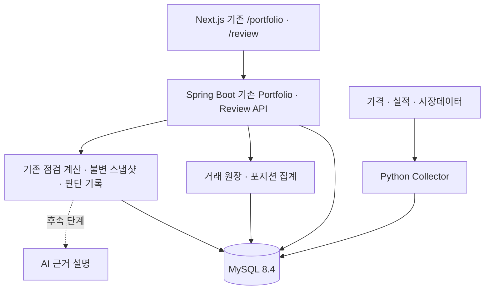

# MarketBoard 투자점검(`/review`) 고도화 구현 가이드

> 개정: 2026-10-09 · 문서 버전: 2.0
> 대상 기술: **MySQL 8.4 / Spring Boot / Next.js / Python Collector / Flyway**
> 목적: **현재 구현된 `/review`와 포트폴리오를 확장**하여 실제 투자자의 거래·위험·의사결정 추적을 지원한다.
> 검증 범위: 2026-10-09 저장소의 MySQL 설정, V9/V10/V24/V25/V26/V34, `PortfolioController`, `PortfolioService`, `PortfolioPosition`, `ReviewController`, 기존 `/review` 화면과 `IdempotencyService`를 정적으로 대조했다. 빌드·테스트·운영 DB 마이그레이션은 실행하지 않았다. 아래 SQL은 **MySQL 8.4 호환 설계 예시**이며 구현 시 현재 브랜치의 다음 Flyway 버전과 실제 엔티티를 다시 확인한다.

## 0. 핵심 변경 요약

이 문서는 새로운 투자점검 서비스를 만들지 않는다. **기존 `/review` + `/api/reviews` + `investment_reviews`/`review_decisions` + `/api/portfolios` + `portfolio_positions`를 유지·확장**한다.

- PostgreSQL, `investment_accounts`, `/investment-review`, `/api/investment/review/*` 제안을 **폐기**한다.
- 신규 계좌 테이블 대신 `portfolios`를 사용한다. 필요 필드(`base_currency`, 현금 상태 등)는 기존 스키마·도메인 의미 검토 후 최소 확장한다.
- 최초 신규 Flyway 버전은 **V35**로 계획한다. V35 이후 마이그레이션이 이미 존재한다면 충돌 없이 다음 버전을 사용한다. **V9/V10/V26/V34 등의 적용 완료 파일은 수정하지 않는다.**
- 기존 포지션을 `OPENING_BALANCE`로 이관한 다음에 수동 거래를 받는다. 원장·포지션은 같은 DB 트랜잭션에서 일관되게 갱신한다.
- 거래는 기존 `symbols.id`와 V25 `IdempotencyService`를 재사용한다. 티커 문자열 기반 종목·별도 멱등성 체계를 만들지 않는다.
- 기존 불변 투자점검 스냅샷과 판단 기록을 재사용하고, 계산 버전 및 원장 버전·데이터 기준일을 연결한다.
- **CSV 가져오기는 후순위**, AI는 결정론적 계산 결과에 대한 출처 포함 설명 역할만 맡는다.

### 비목표

실제 주문 실행, 증권 계좌 자동 연동, 매수·매도 확정 추천, 자동매매, 수익 보장, 세무신고 수준의 실현손익 산정. 투자 판단과 금융 데이터 제공에는 적절한 면책·약관·라이선스 및 보안 검토가 필요하다.

## 1. 현재 구현 현황과 작업 경계

아래는 **사용자가 확인해 준 현재 구현 내용**이다. 표의 '구현됨'은 이번에 직접 소스 검증을 완료했다는 뜻이 아니다.

| 범위 | 현황 | 기존 기준점 | 확장 방향 |
|---|---|---|---|
| 투자점검 화면 | **구현됨** | `/review`, `frontend/src/app/(app)/review/page.tsx`, `AppNavigation.tsx` | 기존 화면에 거래·비중·가설·점검 차이를 표시 |
| 투자점검 API | **구현됨** | `/api/reviews`, `ReviewController.java` | 요청·응답 하위 호환을 지키며 데이터 확장 |
| 판단 기록 | **구현됨** | `/api/reviews/{id}/decisions`, `review_decisions`, V34 | 기존 실행·보류·유지 기록 유지, 사용자 가설과 연계 |
| 불변 점검 스냅샷 | **구현됨** | `investment_reviews`, V26 | 거래/포지션·데이터 스냅샷 버전 참조 추가 검토 |
| 시장지표/시장 폭 | **구현됨** | `/review` | 기존 계산 재사용 |
| 보유 자료 품질 | **구현됨** | `/review` | 거래 원장·이관 상태·시세 최신성 품질에 연결 |
| 위험 신호/판단 초안 | **구현됨** | `/review` | 비중 한도와 투자 가설을 추가 입력으로 사용 |
| 계산 버전 검증 | **구현됨** | `/review` | 원장 로직 버전과 점검 계산 버전 분리 |
| 포트폴리오 | **구현됨** | `/api/portfolios`, `portfolios`, V9 | 기존 식별자와 사용자 소유권 유지 |
| 보유 포지션 | **구현됨** | `/api/portfolios/{id}/positions`, `portfolio_positions`, V10 | 원장 집계 기반 읽기 모델로 전환 |
| 거래 원장 | **신규** | V35 목표 | 수동 거래·멱등성·정정/취소 구조 |
| 기초잔고 이관 | **신규** | 기존 `portfolio_positions` | `OPENING_BALANCE` 이관 및 검증/복구 |
| 투자 가설·비중 규칙 | **확장 필요** | 기존 점검과 결정 기록에 연결 | 신규 테이블 또는 기존 모델 확장, 중복 금지 |
| CSV·고급 위험·AI | **후순위 신규/확장** | Collector/기존 분석 엔진 | 핵심 회계 정확성 확보 뒤 진행 |

### 반드시 열어볼 파일 (구현 직전 확인)

- `marketboardBackend/src/main/resources/application.yaml` 및 `compose.local.yml` — MySQL 연결·환경 값
- `marketboardBackend/src/main/resources/db/migration/V9__create_portfolios_table.sql`
- `marketboardBackend/src/main/resources/db/migration/V10__create_portfolio_positions_table.sql`
- `marketboardBackend/src/main/resources/db/migration/V26__create_investment_reviews.sql`
- `marketboardBackend/src/main/resources/db/migration/V34__create_review_decisions.sql`
- `marketboardBackend/src/main/java/org/juns/marketboardbackend/review/ReviewController.java`
- `marketboardBackend/src/main/java/org/juns/marketboardbackend/portfolio/PortfolioController.java`
- `frontend/src/app/(app)/review/page.tsx` 및 포트폴리오 페이지
- `docs/INVESTING_FEATURES_DESIGN.md` — 특히 기존 포지션 기초잔고 이관 설계(사용자 확인: 77~82행)

**확인된 매핑:** `portfolio_positions.id`는 `BIGINT`, 종목은 `symbol_id`로 `symbols.id`를 참조하며 한 행은 `(portfolio_id, symbol_id)`로 유일하다. 수량은 `quantity DECIMAL(18,6)`, 평균단가는 `avg_cost DECIMAL(18,4)`, 낙관적 잠금은 `version BIGINT`를 사용한다. 구현 직전에는 현금·기준통화 정책과 기존 포지션 등록/수정 경로의 전환 시점을 확정한다.

## 2. 목표 사용자 흐름

1. 기존 `/portfolio`에서 보유 포지션 확인 → 과거에 직접 기입한 포지션은 기초잔고로 안전하게 이관.
2. 사용자가 `/api/portfolios/{id}/transactions`로 매수·매도 거래를 등록.
3. 서버가 거래 원장과 포지션 읽기 모델을 **한 트랜잭션**으로 갱신.
4. 기존 `/review`가 일관된 포트폴리오 상태를 가져와 비중·손익·기존 시장 분석을 함께 점검.
5. 사용자는 점검 스냅샷을 저장하고 기존 `/api/reviews/{id}/decisions`로 **실행/보류/유지**를 기록.
6. 이후 비중 규칙과 투자 가설을 추가하여 과거 판단·현재 상태 변화를 비교.

새 `/investment-review` 라우트나 중복된 리뷰 컨트롤러는 추가하지 않는다.

## 3. 설계 원칙과 도메인 소유권



- `portfolios`: 사용자가 소유하는 포트폴리오의 **정체성** 유지. 별도 `investment_accounts`를 도입하지 않는다.
- `portfolio_positions`: 사용자가 읽는 **현재 상태 투영(projection)**. 새 거래 도입 후에는 원장을 기준으로 재생성 가능해야 한다.
- `portfolio_transactions`(신규 이름 제안): 포트폴리오별 **변경 이력/거래 원장**. 기존 `symbols.id`를 참조하고 수정·삭제 대신 정정 이벤트 또는 명시적 취소 흐름을 사용한다.
- `investment_reviews`/`review_decisions`: 기존 점검 스냅샷/판단 기록. 새 원장을 복사하여 병렬 리뷰 체계를 만들지 않는다.
- Collector: 공통 시장자료·기업 지표를 배치 계산. 사용자별 거래 원장은 Spring Boot에서 관리한다.
- 금융 수치는 `BigDecimal` / MySQL `DECIMAL`, UI에서는 표기할 때만 반올림한다.

### 확정된 회계 범위 (ADR-0001)

**MVP는 USD 주식 수동거래**로 시작한다. `OPENING_BALANCE`, `BUY`, `SELL`, `REVERSAL`만 지원하고 FX, 현금, 배당, 분할, 세무 손익은 지원하지 않는다. 계산은 이동평균법을 사용하며 매수 수수료는 취득원가에 포함하고 매도 수수료는 매도대금에서 차감한다. 중간 계산은 `BigDecimal`로 수행하고 UI 표기에서만 반올림한다.

`OPENING_BALANCE`는 사용자의 **기초 보유원가 스냅샷**을 옮긴 것이지 실제 과거 체결 기록이 아니다. 따라서 기초잔고 이전의 매수시점, 현금흐름, 과거 실현손익은 알 수 없으며 TWR/XIRR 등 장기 성과를 소급 복원할 수 없다.

## 4. MySQL 8.4 / Flyway V35 거래 원장 설계

### 4.1 원장 테이블 제안

아래는 새로운 테이블에 대한 **MySQL 8.4 문법 예시**다. FK가 참조하는 `portfolios.id`의 실제 타입·부호·엔진·인덱스를 반드시 확인한다. 기존 테이블에 컬럼을 추가하는 ALTER 문은 현행 DDL 확인 후 별도 작성한다.

```sql
-- V35__create_portfolio_transactions.sql (설계 예시)
-- portfolios.id가 BIGINT SIGNED인 경우에만 FK 타입이 일치한다.
CREATE TABLE portfolio_transactions (
    id BIGINT NOT NULL AUTO_INCREMENT,
    portfolio_id BIGINT NOT NULL,
    symbol_id BIGINT NOT NULL,
    transaction_type VARCHAR(32) NOT NULL,
    quantity DECIMAL(18, 6) NULL,
    unit_price DECIMAL(18, 4) NULL,
    fee DECIMAL(18, 4) NOT NULL DEFAULT 0,
    currency CHAR(3) NOT NULL,
    occurred_at TIMESTAMP(6) NOT NULL,
    source_transaction_key VARCHAR(128) NULL,
    source_position_id BIGINT NULL,
    reversal_of_transaction_id BIGINT NULL,
    created_at TIMESTAMP(6) NOT NULL DEFAULT CURRENT_TIMESTAMP(6),
    PRIMARY KEY (id),
    UNIQUE KEY uk_portfolio_transaction_source (portfolio_id, source_transaction_key),
    UNIQUE KEY uk_portfolio_opening_position (portfolio_id, source_position_id),
    KEY idx_portfolio_tx_time (portfolio_id, occurred_at, id),
    KEY idx_portfolio_tx_symbol (portfolio_id, symbol_id, occurred_at, id),
    CONSTRAINT fk_portfolio_tx_portfolio
        FOREIGN KEY (portfolio_id) REFERENCES portfolios (id),
    CONSTRAINT fk_portfolio_tx_symbol
        FOREIGN KEY (symbol_id) REFERENCES symbols (id),
    CONSTRAINT fk_portfolio_tx_reversal
        FOREIGN KEY (reversal_of_transaction_id) REFERENCES portfolio_transactions (id),
    CONSTRAINT chk_portfolio_tx_quantity
        CHECK (quantity IS NULL OR quantity > 0),
    CONSTRAINT chk_portfolio_tx_fee
        CHECK (fee >= 0),
    CONSTRAINT chk_portfolio_tx_type
        CHECK (transaction_type IN ('OPENING_BALANCE', 'BUY', 'SELL', 'REVERSAL'))
) ENGINE=InnoDB DEFAULT CHARSET=utf8mb4;
```

> **중요:** `source_position_id`는 확인된 기존 `portfolio_positions.id`를 기초잔고 이관 키로 사용한다. MySQL의 UNIQUE 인덱스는 NULL을 여러 건 허용하므로 `OPENING_BALANCE`에는 이 값을 필수로 검증한다. 수동 거래의 HTTP 재시도는 기존 V25 `IdempotencyService`가 담당하며, `source_transaction_key`는 향후 CSV·외부 원본 거래의 중복 방지용으로만 사용한다. CHECK는 DB의 최종 방어선이고 거래 타입별 필드 조합은 서비스에서도 검증한다.

### 4.2 거래 타입·불변 조건

| 타입 | 수량 | 단가 | 비고 |
|---|---|---|---|
| `OPENING_BALANCE` | 양수 | 기존 평균단가 | 기존 보유분 이관 전용; 수동 API로 생성 금지 |
| `BUY` | 양수 | 양수 | 신규 보유·평균단가 갱신 |
| `SELL` | 양수 | 양수 | 잔여 보유수량 초과 금지 |
| `REVERSAL` | 원거래에 연결 | 정책에 따름 | 정정 전용. 전체 원장을 재생해 일관성 복원하는 방식을 우선 검토 |

`DIVIDEND`, `DEPOSIT`, `WITHDRAWAL`, `SPLIT`은 **미래 확장 타입**으로 정의만 검토하고 수용 API를 열지 않는다. 필요시 현금 원장을 별도로 설계한다. 원장 거래의 `occurred_at`은 실제 거래 시각이며 `created_at`은 시스템에 기록한 시각이다. 타임존 정책(UTC 저장/표시 변환), 중복 종목 식별, 기업행위 처리 원칙을 명시한다.

### 4.3 `portfolios` 최소 확장

- 기존 `portfolios`를 그대로 유지한다.
- `base_currency`가 없을 때만 `CHAR(3)` 추가 여부를 결정하고, 이미 통화 필드가 있으면 재사용한다.
- 현금 잔고가 정확한 거래 원장에 포함되지 않은 상태라면 **현금 수치를 수익률·비중 분모에 임의로 합산하지 않는다.** 현금 추적 기능은 별도 단계로 분리할 수 있다.
- `portfolio_positions`는 조회 API 호환용 현재 포지션으로 유지한다. 거래가 변경되면 서버에서 다시 계산하거나 동일 트랜잭션으로 투영한다.

## 5. 기존 포지션 이관: 필수 설계

### 5.1 데이터 이관 계획

1. **사전 점검:** 기존 포지션의 `(portfolio_id, symbol, quantity, average_price, ...)` 실제 컬럼명·타입과 중복 행, 음수/NULL 수량, 소유권·통화를 확인한다.
2. **읽기 전용 백업/스냅샷:** 영향받는 테이블별 건수, 각 포트폴리오별 종목·수량·평균단가·원가합계와 해시 또는 감사용 파일을 저장한다. 운영 DB 백업/복구 리허설을 별도로 한다.
3. **쓰기 동결:** 이관 구간에 기존 포지션 직접 수정과 신규 거래 등록을 잠시 차단하거나 포트폴리오 단위 잠금을 강제해 경합을 제거한다.
4. **기초잔고 생성:** 각 기존 포지션에 대응하는 `OPENING_BALANCE`를 **한 번만** 생성한다. `source_position_id` 또는 안정적인 `migration_key`를 UNIQUE로 강제한다.
5. **재계산 비교:** 포트폴리오별/종목별 원장 집계 수량과 원가가 기존 포지션 값에 정확히 일치하는지 `DECIMAL` 정밀도 기준으로 검증한다.
6. **전환:** 포지션 쓰기 경로를 원장 기반 서비스 하나로 전환하고 새 거래 API를 활성화한다.
7. **감사:** 전환 시각·대상 건수·실패 목록·검증값·사용한 계산 버전을 로그에 저장한다.

**이관 SQL 주의:** 컬럼명이 확인되지 않았으므로 완성된 `INSERT ... SELECT`를 임의로 제공하지 않는다. 실제 V10 구조에 맞추어 `portfolio_positions` → `portfolio_transactions` 매핑을 확정한 뒤 작성한다. `OPENING_BALANCE`는 실제 체결 시각으로 위장하지 말고, `occurred_at`의 의미를 '기초잔고 적용 기준 시점'으로 문서화한다.

**대규모 이관 권장:** V35는 원장 **스키마만 추가**하고, 기초잔고 적재는 재시도·검증 가능한 별도 배치/관리 작업으로 수행한다. Flyway schema migration 내 긴 DML 실행을 피한다. Flyway가 MySQL DDL을 항상 완전 롤백할 수 있다고 가정하지 않는다.

### 5.2 트랜잭션 및 동시성

```text
POST /api/portfolios/{id}/transactions (Idempotency-Key 필수)
  → 인증 사용자·portfolio 소유권 검증
  → 기존 IdempotencyService로 UUID·요청 해시 검증
  → 동일 키·동일 payload이면 기존 응답 반환, 다른 payload이면 409
  → 신규 요청이면 동일 포트폴리오 행을 SELECT ... FOR UPDATE로 잠금 (InnoDB)
  → 거래 유효성 검증(잔여 수량·소수 정밀도·통화)
  → 원장 INSERT
  → 해당 포지션 집계/투영 UPDATE 또는 UPSERT
  → 원장 합계와 포지션 불변식 검증
  → COMMIT (실패 시 원장·투영 모두 ROLLBACK)
```

- 하나의 Spring `@Transactional` 경계 안에서 모든 쓰기를 수행한다. MySQL InnoDB 트랜잭션만 가정한다.
- 수동 거래의 중복 제출은 기존 `idempotent_requests`의 `(user_id, operation, request_key)` UNIQUE와 요청 해시로 최종 방어한다. 작업명은 `portfolio-transaction`으로 고정하고 해시 입력에는 `portfolioId`와 요청 DTO를 함께 포함한다.
- 같은 요청 키·다른 요청 본문은 기존 `IdempotencyService` 정책대로 409를 반환한다. 거래 테이블에 별도 `client_request_key`나 `request_hash`를 중복 추가하지 않는다.
- 재생 가능한 거래 순서는 `(occurred_at, id)`로 정의하되 **과거 시점 거래 수정/역산**은 별도 정책으로 제한한다. 과거 매매를 나중에 등록하는 경우 평균단가·실현손익 전 구간을 다시 계산해야 할 수 있다.
- 기존 `/positions` POST/PATCH/DELETE는 cutover 뒤 직접 투영을 수정하지 못하게 차단한다. 기존 포지션 생성은 `OPENING_BALANCE`, 수량·평단가 변경은 `REVERSAL`과 대체 거래 등 명시된 원장 흐름으로만 처리한다. **원장과 기존 직접 수정 경로가 동시에 독립적으로 포지션을 갱신하지 않게 한다.**

### 5.3 삭제와 데이터 수명 정책

- 현재 `PortfolioService.deletePortfolio`는 포지션을 삭제한 뒤 포트폴리오를 물리 삭제한다. 원장이 한 건이라도 생긴 포트폴리오는 이 경로를 그대로 사용할 수 없다.
- MVP에서는 거래가 없는 포트폴리오만 기존처럼 삭제한다. 거래가 있으면 `409`로 거절하고, 원장을 보존한 비활성화/보관 정책은 별도 마이그레이션에서 설계한다.
- `portfolio_transactions.portfolio_id`에는 `ON DELETE CASCADE`를 두지 않는다. 실수로 포트폴리오를 삭제해 거래 이력이 함께 사라지는 것을 DB FK가 막게 한다.
- 사용자 탈퇴·개인정보 삭제는 별도 신뢰 경계다. 해당 흐름에서는 거래 원장 → 포지션 → 포트폴리오 순서의 명시적 삭제를 같은 트랜잭션에서 수행하고 테스트한다.
- `source_position_id`는 이관 감사 키이므로 `portfolio_positions` FK를 걸지 않는다. projection을 재생성하거나 삭제해도 원장의 이관 출처 값은 보존한다.

### 5.4 실패·롤백 전략

- **배포 전:** 스키마 변경과 기능 플래그를 분리하는 expand → backfill → validate → cutover 접근.
- **이관 실패:** 새 거래 API 활성화를 중단하고 이전 포지션 읽기 경로 유지. 실패한 기초잔고는 배치 재실행으로 복구(고유 키로 중복 방지).
- **전환 직후 버그:** 새 거래 쓰기를 차단하고 DB 백업·감사 로그를 기반으로 복원/재투영. 신규 체결 기록이 이미 쌓였다면 무조건 이전 DB로 되돌려 **새 거래를 유실하는 롤백은 금지**.
- **스키마 롤백:** 데이터가 담긴 원장 테이블을 즉시 DROP하지 않는다. 애플리케이션 구버전 경로를 기능 플래그로 복구하고, 데이터 보존한 상태에서 후속 수정 마이그레이션을 적용한다.
- **정합성 점검:** 원장 재집계와 `portfolio_positions`를 비교하는 read-only reconciliation 잡/관리 엔드포인트(운영 인증 필수)를 추가할 것을 권장한다.

## 6. 기존 API 우선 확장

아래는 **신규/확장 제안**이다. 기존 URL의 상세 request/response 계약은 컨트롤러와 DTO를 대조해 보존한다.

| Method | 경로 | 작업 | 호환 정책 |
|---|---|---|---|
| 기존 | `/api/portfolios` | 유지 | 변경 불필요 |
| 기존 | `/api/portfolios/{id}/positions` | 원장 집계 결과 조회 | 기존 응답 필드 유지, 선택적 필드 추가 |
| **POST** | `/api/portfolios/{id}/transactions` | 수동 매수·매도 거래 등록 | 신규; 멱등 키 필수 |
| **GET** | `/api/portfolios/{id}/transactions` | 거래 이력 조회 | 신규; 소유권/페이지네이션 |
| 기존 | `/api/reviews` | 기존 점검/불변 저장 | 기존 API 유지; 데이터 품질·비중·가설 연결 |
| 기존 | `/api/reviews/{id}/decisions` | 기존 판단 저장 | 실행/보류/유지 의미 유지 |
| **GET/PUT** | `/api/portfolios/{id}/rules` | 사용자 정의 비중 규칙 | 후속 단계 |
| **GET/POST/PUT** | `/api/portfolios/{id}/theses` | 종목별 투자 가설 | 후속 단계; 버전 정책 포함 |
| **POST** | `/api/portfolios/{id}/transactions/import` | CSV 검증/가져오기 | PR 7에서만 |

### 신규 매수 등록 예시 (확정 계약 아님)

```http
POST /api/portfolios/42/transactions
Idempotency-Key: f0f42c19-7268-40ad-b8ed-a19d3d967ecf
Content-Type: application/json
Authorization: Bearer <token>

{
  "symbol": "AAPL",
  "transactionType": "BUY",
  "quantity": "2.00000000",
  "unitPrice": "185.50",
  "fee": "0.50",
  "currency": "USD",
  "occurredAt": "2026-10-08T19:30:00Z"
}
```

인증 사용자 ID는 body를 신뢰하지 않고 서버 principal에서 확인한다. 포트폴리오 존재/소유권 검증은 모든 GET/POST에 필수. `400` 유효성 오류, `401` 미인증, `403/404` 접근 정책, `409` 키 충돌, `422` 초과 매도 등 오류를 API 정책과 맞춘다. 공개 엔드포인트는 추가하지 않는다.

거래 생성은 기존 `IdempotencyService.execute(userId, "portfolio-transaction", key, {portfolioId + request}, ...)` 패턴을 재사용한다. 해시 입력에 `portfolioId`가 들어가므로 같은 키를 다른 포트폴리오에 재사용하면 409가 된다.

### `/review` 확장 규칙

- 기존 `investment_reviews`의 **불변 스냅샷 의미를 유지**한다. 과거 저장 레코드를 최신 시세/원장으로 다시 덮어쓰지 않는다.
- 새 점검 생성 시 사용할 포트폴리오 상태를 고정(거래 원장 최대 ID/버전, 사용한 가격 데이터 스냅샷 ID, 데이터 기준일, 계산 버전)한다.
- 기존 계산 버전 검증을 깨뜨리지 않도록 필드 추가 방식과 과거 기록 직렬화/역직렬화 호환 테스트를 실시한다.
- 거래 원장과 포지션이 불일치하거나 필수 가격이 오래됐으면, 투자 판단에 영향을 주는 점수/손익을 **확정값처럼 표시하지 않는다**.
- 프론트 `review/page.tsx`의 기존 저장 기록 복원 및 판단 기록 등록 흐름을 회귀 테스트한다.

## 7. 계산 명세와 데이터 신뢰성

### 7.1 수동 매수·매도 (MVP)

- 수량: `new_qty = old_qty + buy_qty - sell_qty` (`new_qty >= 0`).
- 매수 후 원가: `new_cost = old_cost + buy_qty * buy_price + buy_fee`. 평균단가: `new_cost / new_qty`.
- 매도 실현손익: `sell_qty * (sell_price - avg_cost) - sell_fee`. 남은 수량의 평균단가는 바꾸지 않는다.
- 매도 원가: `sold_qty * old_avg_cost`; 실현손익: `sell_qty * sell_price - 매도 수수료 - 매도 원가`. 남은 원가는 `old_cost - 매도 원가`.
- 기존 `OPENING_BALANCE`: `opening_qty × opening_avg_cost`를 이관 원가로 사용. 과거 실현손익이나 수수료 정보를 추정하지 않는다.
- 미실현손익: `시가 × 보유수량 - 잔여원가`; 가격 `asOf`와 통화 기준을 표시.
- 비중: **구성 요소와 분모를 표시**. 현금 미구현 시 종목 평가액 합계 기준 '주식 내 비중'으로 구분하고 '총자산 비중'이라고 표시하지 않는다.
- TWR/MWR(XIRR)은 정확한 입출금 이력과 일별 평가액이 확보된 이후 구현한다.

**예시 검산:** 기초 10주×$100 → BUY 5주×$130(수수료 0) → 평균단가 $110, 15주 → SELL 3주×$120(수수료 0) → 잔여 12주, 원가 $1,320, 실현손익 $30. 소수 계산은 `BigDecimal`, 명시적 rounding mode 사용.

### 7.2 위험/평가 (후속)

- 비중 한도: 현재 비중과 사용자 설정 한도 비교. 금액·분모·통화·시세 시각 표시.
- HHI: `Σ(weight_i²)`; 현금을 포함할지 별도 정의.
- 포트폴리오 변동성: `sqrt(wᵀΣw)`, 수익률 샘플 간격·결측·환율 정합성 확보 후 제공.
- MDD: 연속된 포트폴리오 가치 시계열과 입출금 조정이 충분할 때만 산출.
- 스트레스 분석: 가정된 충격률에 따른 **시나리오 결과**, 예측 확률이나 매도 권고 아님.
- AI: 이미 계산·검증된 수치와 출처를 요약하고 오류/상충하는 근거를 설명. 확정 수치 생성 및 주문 실행 금지.

### 7.3 데이터 품질 표기

가격/환율/재무 각각 `asOf`, `source`, `status(FRESH/STALE/MISSING)` 정책을 둔다. 점검 스냅샷에는 사용한 데이터 스냅샷/계산 버전을 기록한다. 사용자 거래원장의 정확성과 외부 시세의 최신성은 별도 상태로 표기한다.

## 8. 프론트엔드 변경 범위

### `/portfolio` (기존 화면 유지)

1. 기존 보유 목록·수량·평균단가·평가 표시 유지.
2. **매수/매도 등록 UI** 및 거래내역 탭 추가.
3. 이관된 항목은 '기초잔고(과거 체결 정보 없음)' 배지/설명 표시.
4. 저장/전환 중 중복 클릭 방지 + 중복 요청 멱등 키 재사용.
5. 시세 부족/원장 집계 이상 시 해당 금액을 '검증 불가' 처리.

### `/review` (기존 화면 확장)

1. 현재 시장지표·시장 폭·자료 품질·위험 신호·판단 초안·기존 저장 기록 복원 유지.
2. 포트폴리오 선택과 평가 비중·집중도 패널 추가.
3. 기존 판단 실행/보류/유지 기록 UI 재사용.
4. 이후 투자 가설·목표 비중 규칙을 점검 결과에 연결.
5. 과거 점검 레코드에는 당시 스냅샷 기준일·계산 버전·원장 기준점 표시.

새 `/investment-review` 페이지, 중복 판단 기록 컴포넌트, 병렬 review API를 만들지 않는다.

## 9. 구현 PR 순서 및 완료 기준

### PR 0 — 구조·용어·계약 확인 (완료)

- [x] V9/V10/V24/V25/V26/V34의 실컬럼·인덱스·FK 확인
- [x] `PortfolioController`/`ReviewController`의 기존 URL·DTO·소유권 경계 확인
- [x] 기존 포지션 쓰기 경로 POST/PATCH/DELETE 및 삭제 서비스 확인
- [x] USD 주식·이동평균·매수 수수료 원가 포함·매도 수수료 대금 차감으로 확정
- [x] `marketboard.portfolio-ledger-writes-enabled=false` 배포 → 기초잔고 검증 후 `true` 전환
- [x] cutover 뒤 직접 포지션 편집 중단 및 거래 포트폴리오 삭제 `409` 확정
- [x] `CONTEXT.md`와 ADR-0001 기록

### PR 1 — MySQL V35 거래 원장 (완료)

- [x] `V35__create_portfolio_transactions.sql` 추가
- [x] `portfolio_id`/`symbol_id`/정정 원거래 FK와 InnoDB 인덱스 확인
- [x] 외부 원본 키·기초잔고·원거래 정정 UNIQUE와 타입별 CHECK 추가
- [x] `PortfolioTransaction`/타입/Repository 및 금융 정밀도 검증 작성, 기존 API 무변경
- [x] 빈 MySQL 8.4의 V1→V35와 기존 V34 DB의 V35 migrate/validate 성공
- [x] 엔티티 단위·H2 영속성·백엔드 전체 테스트 통과

### PR 2 — 기존 포지션 기초잔고 이관

- [x] 이관 전 백업·카운트·금액 검증값 저장 절차를 운영 런북으로 문서화
- [x] 기존 `portfolio_positions`를 `OPENING_BALANCE`로 매핑
- [x] `source_position_id` UNIQUE 기반 중복 적재 방지와 재실행 검증
- [x] 수량·원가 총합 및 항목별 차이 0 검증, 실패 시 전체 롤백
- [x] 포지션 행 잠금, 기본 OFF 실행 플래그, 쓰기 동결·복구 절차 점검

### PR 3 — 수동 거래 + 투영 동기화

- [x] 기존 `portfolios` 소유권 검사 재사용
- [x] BUY/SELL API + 거래 이력 API
- [x] 원장과 `portfolio_positions` 동일 `@Transactional` 갱신
- [x] 동시 매도, 중복 키, 과다 매도, 시점 역순 입력 테스트
- [x] 기존 포지션 조회 API/쓰기 경로 호환 회귀 테스트
- [x] 거래가 있는 포트폴리오 삭제 거절 및 사용자 탈퇴 시 명시적 원장 삭제 테스트
- [x] 기존 포지션 POST/PATCH/DELETE의 원장 우회 차단

### PR 4 — `/portfolio` 및 기존 `/review` 연동

- [x] 거래 폼/내역 표시, 기초잔고 표시
- [x] 기존 `investment_reviews` 스냅샷/`review_decisions` 유지
- [x] 자료 품질·원장 기준점·계산 버전 확장
- [x] 저장 기록 복원 및 판단 기록 기능 회귀 테스트

### PR 5 — 투자 가설·비중 규칙

- [x] 기존 데이터 모델과 중복되지 않는 가설/규칙 저장 모델 추가
- [x] 가설 개정 이력·무효화 조건·최대 비중 관리
- [x] 기존 리뷰 위험 신호/판단 초안에 연결

### PR 6 — CSV 가져오기

- [ ] 증권사별 포맷 매핑·미리보기·파일 검증
- [ ] 가져오기 중복 판단 키와 원장 멱등성 일치
- [ ] 잘못된 시각·부호·통화·분할·배당 처리 정책
- [ ] 부분 실패 및 재시도 안전성

### PR 7 — 고급 위험 및 AI 설명

- [ ] 충분한 시계열·현금흐름 확보 후 MDD/변동성 등 계산
- [ ] 재현 가능한 시나리오 테스트
- [ ] AI는 스냅샷 기반 설명만; 출처·시점 표기·수치 검증

## 10. 필수 테스트·운영 체크리스트

| 구분 | 테스트/점검 | 통과 기준 |
|---|---|---|
| Flyway | 새 DB 및 V34 DB에서 V35 적용 | migrate/validate 통과, 기존 마이그레이션 무변경 |
| 이관 | 동일 배치 2회 실행 | `OPENING_BALANCE` 중복 0 |
| 이관 | 건별 포지션 수량·원가 비교 | 차이 0(명시된 DECIMAL 정밀도 내) |
| 원장 | BUY·SELL·부분매도·전량매도 | 수량/원가/실현손익 일치 |
| 동시성 | 동일 포트폴리오 동시 SELL | 초과 매도 불가 |
| 멱등성 | 동일 키 같은 요청/다른 요청 | 한 번만 반영 / 충돌 409 |
| 원자성 | 포지션 갱신 시 강제 예외 | 원장도 ROLLBACK |
| 삭제 | 거래가 있는 포트폴리오 삭제 | 409, 원장·포지션 유지 |
| 탈퇴 | 사용자 데이터 삭제 | 원장→포지션→포트폴리오 순으로 함께 삭제 |
| 보안 | 다른 사용자 portfolio/review 참조 | 소유권 노출·수정 불가 |
| 회귀 | 기존 `/api/portfolios/*`, `/api/reviews*` | 기존 저장/조회/판단 기능 정상 |
| 스냅샷 | 과거 리뷰 복원 | 당시 수치와 버전 불변 |
| 데이터 품질 | 늦거나 없는 시세 | 경고/평가 불가 표시, 임의 수치 금지 |
| 복구 | 기초잔고 일부 실패 후 재실행 | 누락만 복원, 중복 없음 |

**검증 수행 여부:** 이 문서는 구현 계획 문서이며, 테스트/빌드/운영 DB 마이그레이션은 실행하지 않았다. 표의 통과 기준은 향후 검증할 수용 조건이다.

## 11. 설계 결정 기록

확정된 결정은 `docs/adr/0001-portfolio-ledger-cutover-policy.md`에 기록한다.

남은 후속 결정:

1. 과거 시점 거래 입력 허용 여부와 재투영 정책.
2. 판단 스냅샷에 남길 원장 기준점(최대 ID/버전/집계 해시)과 데이터 품질 메타데이터.
3. 거래 포트폴리오의 보관·복원 모델.
4. 현금·배당·분할·다중통화 확장 시 원장 타입과 계산 정책.

## 12. 문서 변경 이력

- v1: 일반 신규 투자점검 제품 설계; PostgreSQL 및 별도 계좌·리뷰 API를 가정(현재 저장소에는 부적합).
- **v2 (본 문서):** MySQL 8.4, 기존 `/review`·`/api/reviews`·`portfolios` 중심으로 재작성. V35 원장, 기초잔고 이관, 원자성, 호환성, 롤백 및 순차 PR 계획 반영. 실코드 미검증 부분은 명시적으로 '설계 예시'로 한정.
