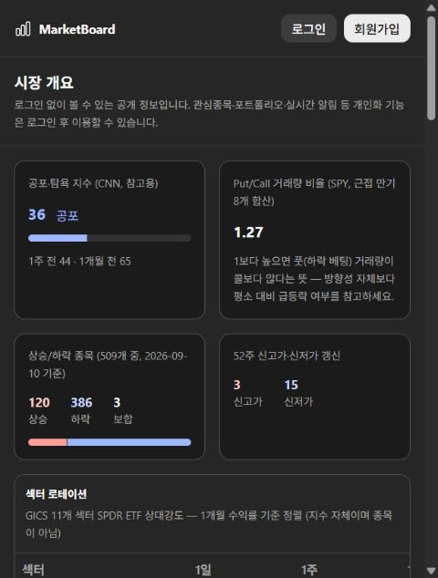
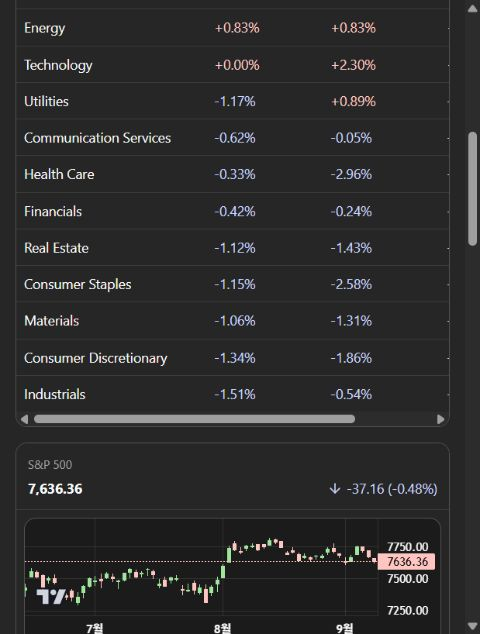

# MarketBoard 투자 워크스페이스 리팩토링 계획

작성: 2026-09-10 · 분석 기준: 로컬 HEAD `0948db9`
상태: 분석 및 실행 계획. 제품 코드 수정/배포 미실시.

> 개발 기준 문서: 루트의 [GENERAL](../../GENERAL.md) / [FUNCTION](../../FUNCTION.md) / [SPEC](../../SPEC.md). 본 문서는 분석 근거로 보존하며, 이후 확정된 루트 문서의 범위·규격을 우선한다.

> 2026-09-10 방향 확정: **주간·월간 시장 파악과 규칙 기반 투자 판단 지원**, 자동 주문 없이 이메일·모바일 알림을 받는 방식이다. [주간·월간 투자 판단 지원 계획](QUANT_TRADING_PLAN.md)을 통합하며, 메뉴·구현 순서는 해당 계획을 우선한다. 주간 점검과 월간 리밸런싱 검토를 기본 흐름으로 삼고 실제 거래 여부는 사용자가 결정한다.

## 1. 결론과 제품 목표

현재 서비스는 시세·시장 지표·분석 기능을 각각 구현했지만, 사용자가 투자 판단을 이어가는 공통 흐름과 계산 기준이 부족하다. 우선순위는 **계산 신뢰성 → 투자 업무 흐름 → 정보 위계와 디자인 → 고급 분석**이다. 디자인 작업도 초기에 시작하되 신뢰성 작업과 함께 진행하고, 불확실한 데이터를 새 UI로 포장하지 않는다.

확정 요구: 주 1회 또는 월 1회 거래 검토, 자동 주문 제외, 이메일·모바일 알림, 실제 투자에 도움이 되는 시장 상황 파악과 체계적 판단. 일별 자료 갱신·주간 시장/위험 점검·월간 리밸런싱 검토를 구분하고, 조건 미충족 시 '유지'를 정상 결과로 제공한다. 미국 주식·ETF와 확정 일봉은 개발 가정이며 자산 목록·규칙 수치·알림 시간은 구현 시 구체화한다.

사용자가 이 서비스로 끝낼 수 있어야 할 일:

1. 오늘 내 보유·관심종목에서 무엇이 달라졌는지 확인한다.
2. 조건에 맞는 종목을 찾아 같은 기간·같은 기준으로 비교한다.
3. 투자 근거, 반대 근거, 재검토 조건을 기록한다.
4. 매수 전 목표 비중을 넣어 포트폴리오 집중도·위험 변화를 확인한다.
5. 전략을 비용과 실행 규칙까지 포함해 검증하고 대조 전략과 비교한다.
6. 실제 매매·입출금을 반영한 성과와 판단 기록을 주기적으로 복기한다.

첫 릴리스는 시장 브리핑과 규칙 기반 검토 결과를 정기 알림으로 전달하고 실행·보류·유지의 근거를 기록하는 흐름을 제공한다. 재현 가능한 백테스트와 모의 운용은 판단의 검증 기반이다. 자동 주문·브로커 주문 연동은 현재 로드맵에서 제외한다. 수익률 보장 점수와 지표 대량 추가는 목표가 아니다.

## 2. 확인한 근거와 한계

| 구분 | 확인 내용 | 한계 |
|---|---|---|
| 소스 | 화면 라우트·패널, 포트폴리오 DTO/서비스, 수집·분석·백테스트, V23까지 마이그레이션 | 실제 DB 데이터 품질은 전수 확인하지 않음 |
| 화면 | 운영 사이트 로그인 진입 → 공개 `/overview` → 섹터 목록·지수 차트, 480px 폭 캡처 | 인증된 종목·포트폴리오·백테스트 화면 및 데스크톱 폭 미검증 |
| 실행 | collector 백테스트/스크리너/정량 분석 테스트 39개 통과 | 전체 시스템·Java·frontend 테스트 통과 의미가 아님 |
| 별도 재현 | 월 경계 리밸런싱 수익 누락, 누락 종목의 조용한 제외 | 작은 인공 데이터 계산 사례. 운영 투자 결과의 오차 크기는 미측정 |

현재 `PROGRESS.md`의 미커밋 변경은 보존했다. 과거 문서의 배포 성공 기록을 이번 실행 검증으로 재사용하지 않았다.

### 화면 관찰

1. **진입: 로그인 필요.** 공개 개요 링크는 있으나 개인화 화면은 접근하지 못했다. 이후 인증 화면에 관한 판단은 소스 구조 분석이다.
2. **시장 개요 상단: 정보는 나오지만 중요도가 평평함.** 공포탐욕·옵션 비율·시장 폭이 비슷한 카드 무게로 먼저 보이고, 대표 지수는 긴 섹터 표 뒤에 있다. 작은 회색 설명 문구가 많아 빠른 스캔이 어렵다. 대비 비율은 측정하지 않았으므로 접근성 위반으로 단정하지 않는다.
3. **섹터·지수: 좁은 화면에서 비교가 불편함.** 섹터 표에 가로 스크롤이 생겨 정렬 기준인 1개월 열을 한눈에 보기 어렵다. 화면은 SPDR ETF를 설명하면서 '지수 자체이며 종목이 아님'이라고 안내하는데 ETF와 지수의 구분도 바로잡아야 한다.

이 두 화면에만 시각적 판단을 적용한다. 키보드 탐색, 스크린리더, 다른 폭의 반응형 및 인증 화면은 새 디자인 승인 전에 추가 확인한다.

## 3. 문제 진단

### A. 계산 결과를 먼저 고쳐야 한다

| 우선순위 | 발견 | 근거·영향 | 처리 |
|---|---|---|---|
| P0 | 월 경계 리밸런싱 수익 누락 | `collector/app/backtest.py:121`: 새 기간 첫 가격으로 다시 정규화하면서 이전 기간 마지막 가격과의 수익을 잃음. AAA 100→110→110, 초기 1,000이면 기대 1,100인데 실제 1,000 | 보유 수량·현금·체결 순서로 재계산하고 월/분기/연 경계 테스트 |
| P0 | 요청 종목이 조용히 제외됨 | `backtest.py:260`: 데이터가 없는 종목을 필터링하고 남은 종목에 비중 재분배. AAA+MISSING 요청이 AAA만으로 성공하는 것 재현 | 요청/적용 종목·가중치 일치 검사. 기본은 실행 차단, 제외는 명시적 선택 |
| P0 | 데이터 누락·짧은 기간이 결과에서 감춰질 수 있음 | `backtest.py:82`의 전체 `dropna()`와 입력 날짜만 조회하는 `run_backtest` | 실제 시작/종료, 종목별 데이터 범위, 누락 거래일, 제외 사유를 사전 검사 결과로 반환 |
| P1 | 지표 준비 기간이 평가 기간 안에 들어감 | `backtest.py:148,169,329`: SMA/200일 추세를 요청 시작 이후 자료로 계산 | 시작일 이전 준비 데이터를 추가 조회. 지표 준비 완료 후 동일 평가 기간으로 비교 |
| P1 | 체결·비용 가정이 빈약함 | 가격 곡선 중심 계산, 수수료/슬리피지/거래 기록·현금 이자 모델 없음 | 신호 시점/체결 시점·가격·비용·현금 수익 가정을 명시하고 공통 실행 모델로 통일 |
| P1 | 실행 재현성이 부족함 | 백테스트 config/result JSON은 있으나 데이터 버전·엔진 버전이 없음. 몬테카를로는 외부 주입 seed 없음 | 데이터 스냅샷 식별자·계산 버전·실제 기간·seed 저장 |

기존 월별 리밸런싱 테스트는 월 경계의 가격이 동일한 예제를 사용한다(`collector/tests/test_backtest.py:95`). 그래서 39개가 통과해도 첫 문제를 잡지 못한다. 재현 스크립트는 `reproduce_backtest_findings.py`에 남겼다. 진단만 했으며 제품 버그는 아직 수정하지 않았다.

### B. 포트폴리오가 '투자 기록'이 아니라 '현재 보유 입력표'다

- `PortfolioPosition.java:29`는 수량·평단가 스냅샷이다. 매수/매도·입출금·배당·수수료·환전 원장이 없다. 실현손익, 현금흐름을 제거한 수익률, 기간별 성과를 정확히 복원할 수 없다.
- `PortfolioSummaryResponse.java:29`는 가격 없는 종목의 평가액과 원가를 합계에서 제외한다. 일부 종목만 가격이 있어도 화면은 '총 평가금액/총 매입금액'으로 표시한다. 부분 합계임을 별도로 알려야 한다.
- `QuoteService.java:138`는 Redis 시세 존재 여부를 확인하지만 노후화 검사는 없다. `ResolvedPrice`도 가격·isLive만 반환하므로 최종 거래 시각이 보유 평가에 전달되지 않는다. 'LIVE'가 데이터의 신선도를 보장하지 못한다.
- 포트폴리오 성과와 가상의 전략 성과가 공통 기간·벤치마크·통화로 비교되는 구조가 없다.

### C. 데이터의 기준과 역할이 섞여 있다

- Finnhub 틱, yfinance 일봉·재무, CNN 심리, CBOE 옵션, Wikipedia의 현재 S&P500 구성 종목을 사용한다. 여러 공급자를 쓰는 자체가 문제는 아니지만 관측 시점·통화·정규장 여부·가격 보정·표본을 공통으로 설명하지 않는다.
- `price_history`에는 원천·보정 방식·수집 시점·버전 컬럼이 없다. yfinance `history/download`에서 보정 옵션도 명시하지 않으므로 저장 자료만으로 분할/배당 처리 방법을 확인하기 어렵다. 실제 오염 여부는 데이터 대조가 필요하다.
- 현재 구성 종목을 과거 전체 기간의 투자 가능 집합으로 해석하면 생존편향이 생긴다. 현재 스크리너 자체는 현재 후보 탐색용이다. 이를 과거 종목선정 전략 성과로 연결할 때 반드시 구분해야 한다.
- 스크리너는 가격 기반 상위 후보를 먼저 제한·분산 선택한 후 일부 후보의 최신 재무/뉴스를 조회한다(`screener.py:282`). 이는 '전체 종목 중 재무 조건 통과 종목'을 모두 찾는 화면 의미와 다를 수 있다. 어떤 순서로 얼마나 제외됐는지 필요하다.
- 종목별 `dropna()` 뒤 최신일 비교가 없어 날짜가 다른 종목의 모멘텀을 같은 표에 놓을 수 있다. 상관계수의 관측 개수·NaN 처리도 명시해야 한다.
- 뉴스 감성은 TextBlob 제목 평균이고 Hurst는 단순 임계값 분류다. 검증된 매수 신호처럼 강조할 근거가 부족하다. 몬테카를로도 가정 기반 시나리오이며 예측 정확도를 검증한 결과가 아니다.

### D. 메뉴와 패널의 단위가 투자 업무와 맞지 않는다

`frontend/src/app/(app)/layout.tsx`는 종목 리스트·대시보드·시장 지표·재무 대시보드·포트폴리오·백테스팅·스크리너를 같은 수준에 나열한다. 종목 찾기/연구하기가 여러 화면으로 분리되고, 무엇부터 해야 할지 사용자가 직접 연결해야 한다.

종목 상세는 기업개요·기술지표·옵션·정량분석·차트·알림·뉴스를 각각 패널로 배치한다. 정보가 있어도 '이 종목을 왜 검토하고, 어떤 조건에서 생각을 바꿀 것인가'를 기록하는 흐름이 없다. 자유로운 대시보드 편집은 핵심 기본 화면이 완성된 다음의 선택 기능이어야 한다.

## 4. 목표 화면 구성

최상위 메뉴는 **투자 점검 / 전략 연구 / 포트폴리오 / 데이터·종목** 네 개로 재편한다. 종목 탐색·비교·연구는 데이터·종목 아래에서 연결한다. 투자 점검의 첫 화면은 주간 시장 브리핑·월간 비중 검토·판단 근거이며, 기존 URL은 유지하거나 새 화면으로 연결한다.

| 화면 | 가장 먼저 답할 질문 | 기본 정보 | 다음 행동 |
|---|---|---|---|
| 투자 점검 | 이번 주/월 무엇을 확인하고 왜 유지·변경할까? | 시장 추세·시장 폭·변동성·금리/환율, 보유 영향, 기준일, 규칙 충족 여부 | 상세 검토 후 실행/보류/유지와 이유 기록 |
| 종목 탐색 | 어떤 후보를 왜 검토할까? | 저장된 조건, 통과/제외 이유, 같은 기준일의 수익률·위험·재무 | 2~4종목 비교, 관심종목 저장 |
| 종목 연구 | 투자 근거와 반대 근거는? | 가격/벤치마크, 사업·재무 추이, 가치평가, 위험, 보유 여부 | 투자 메모, 재검토 조건, 목표 비중 시뮬레이션 |
| 내 포트폴리오 | 어디에 얼마나 노출되어 있고 성과 원인은? | 평가 범위, 비중·현금, 손익, 성과 곡선, 집중도·기여도 | 거래 기록, 목표 비중과 편차 검토 |
| 전략 연구 | 이 규칙이 비교 기준보다 나은가? | 명시적 가설·가정·자료 범위, 동일 조건 벤치마크, 위험·비용 | 실험 저장/비교, 결과 한계 확인 |

대표 흐름: 이메일/모바일 정기 알림 → 시장 변화·내 보유 영향 → 저장 규칙과 목표 비중 검토 → 실행/보류/유지 및 근거 기록 → 거래했다면 실제 거래 입력 → 다음 점검에서 복기. 시장 맥락 설명과 행동 규칙을 분리하고, 알림 수신이나 실행 결정만으로 체결 처리하지 않는다.

### 디자인 방향

- 기본은 밀도 있는 분석용 표와 하나의 주 차트. 같은 크기의 숫자 카드 여러 개를 첫 화면에 쌓지 않는다.
- 페이지 상단에 대상·평가 기간·벤치마크·통화·기준일을 고정하고, 핵심 지표는 3~4개로 제한한다.
- 숫자는 자릿수·단위·정렬을 통일한다. 가격 변화는 %/가격, 수익률 차이는 %p, 금리 변화는 bp로 구분한다.
- 상승/하락 색은 기존 빨강/파랑 관행을 일관되게 유지하되 +/- 및 라벨을 함께 쓴다. 데이터 경고의 노랑/빨강은 투자 수익 색과 혼동하지 않게 영역과 아이콘으로 구분한다.
- 좁은 화면은 비교 기준 열을 우선 유지하고 나머지는 행 확장으로 연다. 대형 표 전체를 가로로 밀어 보는 것을 기본 UX로 삼지 않는다.
- 옵션·Hurst·몬테카를로·뉴스 감성은 '고급 분석'에 두고 첫 화면에서 내린다. 금리 만기별 차트·캐나다 지수도 기본 시장 요약에서 내려 선택 확장으로 둔다.
- Astryx 교체부터 시작하지 않는다. 숫자·표·상태·차트 범례에 공통 컴포넌트와 토큰을 먼저 만들고, 요구를 충족하지 못하는 컴포넌트만 대체한다.
- 구현 전 인증된 현재 화면 4종과 새 '오늘/종목/포트폴리오' 디자인 시안을 비교한다. 이번 문서는 정보구조와 방향이며 완성된 시각 디자인이 아니다.

## 5. 데이터와 계산 계약

### 데이터 신뢰성

모든 분석 응답은 `asOf`, `fetchedAt`, `source`, `currency`, `session`, `priceBasis`, `methodVersion`, `coverage`, `warnings`를 공통 의미로 제공한다. 항목별 갱신 시간이 다르면 항목별 메타데이터를 둔다. 결측을 0으로 표현하지 않는다. 장 휴장과 공급자 장애를 구별한다.

| 데이터 | 우선 정책 | 확인 기준 |
|---|---|---|
| 실시간/최근 시세 | 관측 시각·정규장/시간외/종가·노후화 상태 구분 | 연결 상태와 가격 신선도가 독립적으로 표시됨 |
| 일봉 | 거래일·원천·가격 보정 명시. 분할/배당 이벤트와 분석용 수익률 정책 분리 | 기업행사 전후 비교 자료와 재계산 결과 일치 |
| 재무 | 회계기간·연간/분기/TTM·발표/가용 시점·통화 명시 | 같은 기간 기준으로만 비교, 과거 실험에 미래 발표값 사용 금지 |
| 스크리너 | 동일 기준일 스냅샷, 조건 통과와 데이터 부족을 구분 | 전체/유효/누락/조건 탈락 수 합계 일치 |
| 벤치마크 | 사용자 선택, 동일 기간·통화·가격/총수익 기준 | 자산과 지수의 배당 처리 차이로 비교 왜곡 없음 |
| 옵션·심리·뉴스 | 공급자·지연·표본·계산 방식 표시, 보조 자료 | 수집 실패가 다른 핵심 화면을 막지 않음 |

초기 원천은 기존 공급자를 유지한다. 필요한 신뢰도를 무료 자료로 충족하지 못하면 데이터 기능 범위를 줄이거나 예산을 별도로 정해 유료 원천을 검토한다. 과거 구성 종목·상장폐지·발표 시점 자료를 확보하기 전에는 '당시 투자 가능 종목 기반 검증'으로 표시하지 않는다.

### 실제 포트폴리오

- 원장 이벤트: 매수, 매도, 입금, 출금, 배당, 수수료, 분할, 필요시 환전. 이벤트 시각·통화·원천·중복 식별자를 저장하고 정정은 추적 가능하게 한다.
- 현재 보유는 원장으로 계산하는 읽기 모델. 기존 수량/평단가는 전환 기준일의 **기초 잔고**로 이관하고 과거 매수일을 만들어내지 않는다. 전환일 이전 수익률은 '자료 없음'이다.
- 원가법은 우선 이동평균 등 한 방법을 명시적으로 선택한다. 세무 신고용 손익과 동일하다고 주장하지 않는다.
- 실현/미실현 손익, 현금, 배당, 비용을 분리한다. 시간가중수익률(TWR)은 외부 현금흐름 영향을 제거하고, 금액가중수익률(XIRR)은 투자자의 실제 입출금 경험을 보여준다. 현금흐름과 평가 자료가 충분할 때만 계산한다.
- 기준통화는 USD 우선, KRW 환산은 환율 시점·환전 원가가 준비된 후 별도 표시한다. 단순 현재 환율 변환을 원화 투자 수익률이라고 부르지 않는다.
- 위험은 개별/섹터 비중, 상위 5종목 집중도, 동일 기간 상관관계, 벤치마크 민감도부터 제공한다. ETF 내부 보유 비중을 확보하지 않았다면 ETF 간 실질 중복은 계산했다고 표시하지 않는다.

### 백테스트

입력 → 자료 사전 검사 → 신호 생성 → 다음 시점 체결 → 수량/현금 평가 → 지표 계산 → 결과 저장 순서를 분리한다. 기본 체결은 다음 거래일 시가와 비용으로 정의하고 시가가 없을 때 조용히 종가로 바꾸지 않는다. 기존 종가 기반 결과는 legacy 모델로 구분해 보존한다.

저장할 항목: 요청/실제 종목과 비중, 평가 기간·준비 기간, 거래일 달력, 벤치마크, 통화, 배당/분할 처리, 수수료·슬리피지·현금 이자, 엔진 버전, 데이터 스냅샷 ID/해시, seed, 경고, 체결 내역, 일별 NAV·현금·노출, 결과 지표. 해시만 저장하지 말고 해당 입력 데이터를 다시 불러올 수 있어야 한다.

결과는 전략/벤치마크/동일 종목 buy-and-hold를 같은 표로 비교한다. CAGR·MDD·변동성·Sharpe·회전율·비용·투자 노출 시간과 수익률/낙폭 곡선을 우선 제공한다. 승률·Profit Factor는 청산 거래 정의와 표본이 갖춰진 전략에만 표시한다. 실험 이름만 다른 단일 결과보다 저장 실행의 나란히 비교가 중요하다.

아웃오브샘플 기간과 파라미터 민감도는 기본 엔진 검증 다음 단계다. 전체 기간에서 가장 좋은 조합을 골라 같은 기간 성과로 검증했다고 표현하지 않는다. 몬테카를로는 수익률 예측이 아닌 가정별 시나리오 탭으로 유지한다.

## 6. 구현 구조와 이관 원칙

- Next.js/Spring/Python 3개 구조, 인증·권한·실시간 전달·기존 시세 저장을 재사용한다. 새 마이크로서비스나 메시지 플랫폼은 먼저 도입하지 않는다.
- Spring은 사용자 소유 데이터·원장·설정·실행 상태를 담당하고 Python은 공통 가격 자료 위의 분석 계산을 담당한다. 회계 수량·현금과 가격/수익률 계산의 공통 계약을 테스트로 고정한다.
- Python의 `backtest`, `quant_analysis`, `screener`가 쓰는 가격 조회·기간 정렬·단위·결측 처리·기본 위험 지표를 공통 모듈로 묶는다. 전략 신호와 체결/평가 엔진을 분리한다.
- 스크리너 기본 조회는 배치 스냅샷에서 제공한다. 오래 걸리는 실험은 기존 실행 테이블을 확장한 작업 상태와 제한된 worker로 처리한다. 외부 호출 중 DB 트랜잭션을 길게 잡지 않는다. 취소·시간제한·실패 사유를 표시한다.
- 신규 데이터 구조 후보는 `data_snapshots`, `screening_snapshots`, `portfolio_transactions`, `portfolio_valuations`, `investment_notes`와 기존 `backtest_runs` 확장이다. 별도 전략 정의 테이블은 재사용 요구가 확인된 뒤 결정한다.
- 데이터 변경은 기존 V1~V23 수정 없이 신규 Flyway 마이그레이션을 추가한다. 실제 다음 번호는 착수 시 재확인한다.
- 보유 스냅샷 이관은 dry-run → 전환일·수량·원가 합계 대조 → 사용자 확인 후 적용. 구 테이블/실행 이력은 바로 삭제하지 않는다. 새 화면은 제한적으로 켜고 기존 화면으로 복귀할 수 있게 한다.

## 7. 실행 순서와 완료 기준

기간은 데이터 확보 수준에 따라 크게 달라지므로 날짜 확정보다 아래 완료 조건을 통과하는 방식으로 진행한다. 아래는 기술 작업 분해이며 실제 우선순위는 QUANT_TRADING_PLAN.md의 Q0~Q6을 따른다. 시장 브리핑·규칙 판단·정기 알림을 앞당기고 일반 탐색 확장은 뒤로 둔다. 디자인 시안은 1단계와 병행 가능하지만 실제 기능 연결은 데이터 계약 확정 후 한다.

| 단계 | 작업 묶음 | 완료 기준 | 의존성 |
|---|---|---|---|
| 0. 투자 용도·디자인 합의 | 투자 기간·주요 자산·점검 주기·기준통화, 인증 화면 관찰, 새 핵심 화면 시안 | 4개 주 메뉴 및 한 번의 투자 검토 흐름 합의 | 없음 |
| 1. 숫자 신뢰성 복구 | 월 경계 수정, 누락 종목 차단, 준비 기간, 가격 기준·범위 표시, 부분 평가 표시 | 손계산 사례 및 데이터 누락/날짜 경계 회귀 검사 통과, 실제 적용 범위가 결과에 보임 | 없음 |
| 2. 첫 투자 검토 흐름 | 스냅샷 기반 탐색 → 비교 → 종목 연구 → 관심/투자 메모; 새 공통 화면 틀 | 필터·기간을 유지한 채 2~4종목 비교와 검토 근거 저장을 끝낼 수 있음 | 0, 1 |
| 3. 실제 포트폴리오 기반 | 원장·기초 잔고 이관·현금/배당/비용·일별 평가·집중도 | 매수→추가매수→부분매도→배당→입출금 손계산 일치, 누락 평가와 이관 이전 성과 구분 | 1 |
| 4. 전략 연구 체계화 | 공통 체결 엔진·비용·벤치마크 비교·실행 저장/비교·작업 상태 | 입력 스냅샷과 버전이 같으면 재실행 일치, 미래 자료 차단, 체결과 NAV 대조 | 1, 2의 공통 UI |
| 5. 투자 점검 화면 통합 | 주간 브리핑·월간 검토, 이메일/모바일 알림, 판단 기록·복기 | 화면 간 수치 일치, 중복 알림 억제, 실패/권한 거절 대안 및 유지 결과 설명 | 2, 3, 4; 브리핑·알림 MVP는 Q2에서 선행 |
| 6. 제한 공개·운영 검증 | 기존/신규 결과 대조, 사용자 실제 점검 과정, 지연/오류 관찰 | 출시 차단 계산 오류 0, 되돌리기 확인, DB/API/브라우저/배포 점검 기록 | 5 |

### 바로 착수할 수 있는 작업 단위

1. **계산 기준서 + 회귀 사례**: 위 재현 2건, 월/분기/연 경계, 준비 기간, 거래일 누락, 종료일 포함 여부, 분할/배당, 비용 0 대비 비용 포함 결과. 수정 전 실패를 먼저 확인한다.
2. **평가 품질 API와 UI**: `ResolvedPrice`에 관측 시각/상태, 포트폴리오에 priced/unpriced 수·부분 합계 여부, 백테스트에 requested/effective range와 warnings를 추가한다. 각 API와 이를 표시하는 화면을 함께 변경한다.
3. **화면 시안과 최소 UI 계약**: 오늘·종목 연구·포트폴리오 3개를 동일한 숫자/기간/상태 규칙으로 설계하고 그중 종목 탐색→연구 흐름부터 구현한다.
4. **포트폴리오 원장 설계·dry-run 도구**: 현재 보유와 새 기초 잔고 비교표를 만들고 실제 이관은 별도 실행한다.
5. **실험 결과 계약**: legacy 실행은 보존하고 새 모델 버전으로만 엄밀한 재현성과 비용 적용을 보장한다.

## 8. 성공 지표와 릴리스 검사

- 투자 작업: 사용자가 정기 알림에서 시작해 5~10분 안에 시장 변화와 내 규칙의 근거를 이해하고 실행·보류·유지를 기록할 수 있는지 확인한다. 이는 목표이며 현재 측정치가 아니다.
- 데이터: 핵심 숫자에서 출처·시점·범위를 확인 가능, 제외 종목 100% 사유 표시, 결측의 0 대체 금지, 부분 평가를 전체 평가로 표시하는 사례 0.
- 계산: 고정 자료에서 엔진 버전별 재실행 일치, 신호 계산에 이후 데이터 사용 금지, 원장 수량·현금·평가액이 손계산과 일치.
- 비교: 전략·벤치마크·실제 보유 비교의 기간/통화/가격 기준이 같거나 차이가 명시되어 있음.
- 성능: 기본 조회는 캐시/스냅샷에서 목표 p95 2초 이내. 장기 계산은 진행 상태를 빠르게 반환하고 제한시간·실패 원인을 표시한다. Pi 실측 후 예산 조정.
- UI: 390/768/1440px에서 핵심 비교 항목 접근 가능, 키보드 포커스·차트 대체 수치·빈 상태·부분 실패 확인.
- 검증 계층: Python 독립 계산 사례 → Java 소유권/원장/API 통합 → 실제 MySQL/Redis → 브라우저 전체 흐름 → 배포 환경. 현재 실행한 39개 단위 테스트만으로 출시 판정하지 않는다.

## 9. 이번 분석의 실행 기록

`collector/.venv/Scripts/python.exe -B -m pytest tests/test_backtest.py tests/test_screener.py tests/test_quant_analysis.py -q -p no:cacheprovider`: **39 passed in 1.27s**.

직접 호출 재현: 월 경계 기대 최종자산 1,100 / 실제 1,000, 요청 AAA+MISSING / 실제 AAA만 반환. 동일 재현을 문서 옆 스크립트에 보존했다.

운영 공개 화면을 읽고 캡처했지만 데이터 원천과 수치 대조, 인증된 투자 흐름, 전체 테스트, DB 이관 및 배포는 수행하지 않았다. 사용자가 요청한 분석·계획 범위에서 새 문서와 근거만 추가했다.
